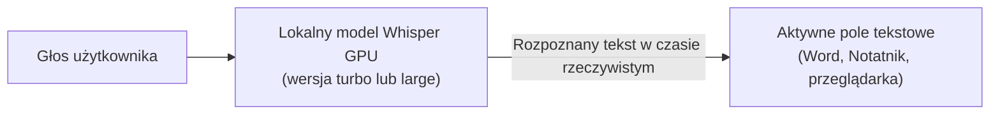
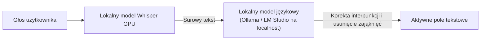
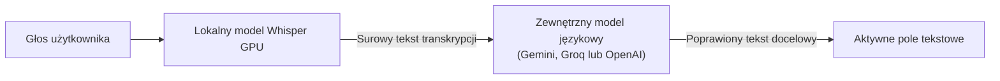

# Whiscribe - natywne wpisywanie głosowe dla Windows

Whiscribe to zaawansowana aplikacja desktopowa do dyktowania i wpisywania głosowego w systemie Windows. Wykorzystuje lokalny model Faster-Whisper large-v3-turbo akcelerowany sprzętowo przez NVIDIA CUDA (oraz zoptymalizowany pod kątem procesorów CPU), zapewniając jakość rozpoznawania mowy na poziomie rozwiązań komercyjnych przy zerowym opóźnieniu i pełnej prywatności.

Aplikacja integruje się bezpośrednio z aktywnym polem tekstowym w systemie Windows: edytorami tekstu (Word, Notatnik), arkuszami kalkulacyjnymi, przeglądarkami internetowymi (Chrome, Edge, Firefox), komunikatorami (Slack, Discord, Teams) oraz środowiskami programistycznymi (VS Code, Cursor, Visual Studio).

---

## Kluczowe możliwości

### 1. Nowoczesny widżet interfejsu (Windows 11)
- **Minimalizacja do paska zadań Windows 11:** Widżet posiada dedykowany przycisk minimalizacji oraz natywny przycisk na dolnym pasku zadań (`WS_EX_APPWINDOW`, `WS_MINIMIZEBOX`). Kliknięcie przycisku minimalizuje aplikację do paska zadań, a ponowne kliknięcie na pasku lub w zasobniku systemowym natychmiast przywraca widżet na ekran.
- **Zawsze na wierzchu (Always on Top):** W trybie domyślnym widżet unosi się ponad oknami systemu dzięki mechanizmowi pętli kontroli kolejności okien. Nie znika pod aktywnymi aplikacjami roboczymi.
- **Brak kradzieży fokusu:** Kliknięcie w dowolny element interfejsu (przycisk mikrofonu, ustawienia) nie odbiera fokusu z edytora tekstu, w którym aktualnie znajduje się kursor.
- **Swobodne przemieszczanie:** Możliwość płynnego przeciągania widżetu w dowolne miejsce ekranu oraz między wieloma monitorami.

### 2. Dwa tryby wpisywania (streaming włączony lub wyłączony)
Na belce widżetu znajduje się dedykowany przełącznik trybu wprowadzania tekstu:
- **Streaming włączony (pisanie na żywo):** Tekst pojawia się w polu edycyjnym w czasie rzeczywistym, słowo po słowie, bezpośrednio w trakcie wypowiedzi. Algorytm dopasowywania sekwencji eliminuje powtórzenia wyrazów.
- **Streaming wyłączony (zatwierdzanie blokowe):** Wypowiadane jest pełne zdanie lub akapit. Po zwolnieniu skrótu, kliknięciu mikrofonu lub automatycznym wykryciu pauzy ciszy, zoptymalizowany tekst z pełną interpunkcją i wielkimi literami pojawia się w miejscu kursora.

### 3. Wielowarstwowy filtr eliminacji zniekształceń i halucynacji
Whiscribe zawiera moduł filtrujący zniekształcenia charakterystyczne dla modeli Whisper (wtrącenia ze zwiastunów wideo, napisy końcowe z nagrań internetowych), jednocześnie precyzyjnie przepuszczając naturalne polskie powitania, pożegnania i zwroty grzecznościowe (np. "dzień dobry", "cześć", "do widzenia", "dzięki za informację").

### 4. Detektor aktywnego pola tekstowego
Moduł inspekcji interfejsu weryfikuje obecność kursora w edytowalnym elemencie systemu Windows:
- Zapobiega przypadkowemu wklejaniu tekstu na pulpit, do menu kontekstowego lub na paski narzędziowe.
- Wyświetla czytelny komunikat w przypadku próby dyktowania bez aktywnego pola tekstowego.

### 5. Globalne skróty klawiszowe w systemie Windows
Rejestracja skrótów na poziomie systemu operacyjnego pozwala na natychmiastowe rozpoczęcie dyktowania z dowolnego miejsca w systemie:
- Domyślny skrót dyktowania: `Ctrl + Alt + D`.
- Domyślny skrót trybu spotkania: `Ctrl + Alt + M`.
- Pełna możliwość modyfikacji kombinacji klawiszy w pliku konfiguracyjnym.

### 6. Architektura systemu: praca offline oraz moduł korekty językowej

Whiscribe został zbudowany z naciskiem na prywatność danych użytkownika. Model rozpoznawania mowy działa całkowicie lokalnie.

#### Tryb 1: Domyślny - praca całkowicie offline (tylko lokalny model Whisper)
Domyślnie w pliku konfiguracyjnym parametr `use_llm` ma wartość `false`. Aplikacja nie łączy się z internetem i nie przesyła żadnych danych audio ani tekstu poza komputer użytkownika. Całość obliczeń realizowana jest lokalnie przez kartę graficzną lub procesor.



#### Tryb 2: Praca offline z lokalnym modelem językowym (Ollama lub LM Studio)
W przypadku posiadania lokalnie uruchomionego serwera modeli językowych (np. Ollama na porcie 11434 lub LM Studio na porcie 1234), możliwa jest automatyczna korekta tekstu bez łączenia się z internetem.



Przykład konfiguracji w `config.json` dla narzędzia Ollama:
```json
"use_llm": true,
"llm_provider": "ollama",
"llm_endpoint": "http://localhost:11434/v1",
"llm_model": "llama3.2",
"llm_api_key": ""
```

#### Tryb 3: Opcjonalna korekta chmurowa (Google Gemini, Groq, OpenAI)
Dla użytkowników preferujących zewnętrzną korektę stylistyczną istnieje możliwość podpięcia zewnętrznego interfejsu programistycznego:



#### Rola i budowa promptu systemowego (llm_system_prompt)
Domyślna treść instrukcji dla modułu korekty:
```text
Jesteś polskim korektorem tekstu dyktowanego. Popraw zająknięcia (np. yyy, eee), błędy interpunkcyjne i formatowanie. Nie zmieniaj sensu wypowiedzi. Zwróć WYŁĄCZNIE poprawiony tekst, bez żadnych dodatkowych komentarzy ani cudzysłowów.
```
- Usunięcie zająknięć: eliminuje dźwięki namysłu i mimowolne powtórzenia wyrazów.
- Zachowanie sensu wypowiedzi: zapobiega dodawaniu własnych wniosków przez model.
- Format odpowiedzi: nakaz zwrotu wyłącznie czystego tekstu zapobiega dołączaniu komentarzy wstępnych. Treść można dostosować w pliku konfiguracyjnym pod kątem specyfiki redagowanych pism.

---

## Plany rozwoju: transkrypcja spotkań zespołowych i rozpoznawanie osób

Aplikacja jest rozwijana w kierunku rejestracji i protokołowania spotkań zespołowych (Microsoft Teams, Google Meet, Zoom):

1. **Równoległy nasłuch dwukanałowy:**
   - Rejestracja głosu użytkownika bezpośrednio z mikrofonu fizycznego.
   - Równoległa rejestracja głosu pozostałych rozmówców z wyjścia karty dźwiękowej za pośrednictwem pętli zwrotnej systemu Windows.
2. **Rozpoznawanie uczestników na podstawie cech głosu:**
   - Wykorzystanie analizy barwy głosu, częstotliwości podstawowej oraz parametrów widmowych dźwięku.
   - Automatyczne przypisywanie poszczególnych wypowiedzi do właściwych osób w zespole.
3. **Automatyczne protokoły i podsumowania:**
   - Zapis transkrypcji z podziałem na role do formatu tekstowego oraz Markdown.
   - Generowanie podsumowań ustaleń i listy zadań po zakończeniu spotkania.

---

## Uruchomienie aplikacji

### Wariant A: Wersja przenośna (wersja bez instalacji środowiska Python)
1. Pobierz archiwum `Whiscribe-Portable.zip` z sekcji wydań na GitHubie.
2. Rozpakuj archiwum do wybranego katalogu na dysku.
3. Uruchom plik `Whiscribe.exe`.
4. Przy pierwszym uruchomieniu nastąpi automatyczna weryfikacja konfiguracji sprzętowej i pobranie wybranego modelu mowy.

### Wariant B: Uruchomienie z kodu źródłowego
Wymagania: Python 3.10 lub nowszy, opcjonalnie karta graficzna NVIDIA z obsługą biblioteki CUDA.

```bash
# 1. Klonowanie repozytorium
git clone https://github.com/sooony/Whiscribe.git
cd Whiscribe

# 2. Utworzenie i aktywacja środowiska wirtualnego
python -m venv venv
venv\Scripts\activate

# 3. Instalacja zależności
pip install -r requirements.txt

# 4. Uruchomienie aplikacji
python app.py
```

---

## Konfiguracja (config.json)

Plik konfiguracyjny `config.json` tworzony jest automatycznie przy pierwszym uruchomieniu:

```json
{
  "hotkey": "<ctrl>+<alt>+d",
  "hotkey_meeting": "<ctrl>+<alt>+m",
  "mode": "toggle",
  "model_size": "turbo",
  "device": "cuda",
  "compute_type": "float16",
  "language": "pl",
  "always_on_top": true,
  "stream_realtime": false,
  "require_text_field": true,
  "sound_feedback": true,
  "auto_stop_silence_seconds": 4.5,
  "theme": "dark",
  "use_llm": false,
  "llm_provider": "gemini",
  "llm_api_key": "",
  "llm_model": "gemini-2.0-flash",
  "llm_system_prompt": "Jesteś polskim korektorem tekstu dyktowanego. Popraw zająknięcia (np. yyy, eee), błędy interpunkcyjne i formatowanie. Nie zmieniaj sensu wypowiedzi. Zwróć WYŁĄCZNIE poprawiony tekst, bez żadnych dodatkowych komentarzy ani cudzysłowów."
}
```

### Wybrane parametry:
- `always_on_top`: utrzymuje widżet na wierzchu ekranu.
- `stream_realtime`: przełącza pisanie w czasie rzeczywistym w trakcie mówienia.
- `require_text_field`: weryfikuje obecność aktywnego pola tekstowego przed rozpoczęciem wpisywania.
- `auto_stop_silence_seconds`: czas ciszy w sekundach, po którym nagranie zostaje automatycznie zakończone i przetworzone.
- `use_llm`: aktywuje opcjonalną korektę stylistyczną i interpunkcyjną.

---

## Bezpieczeństwo i prywatność danych

- **Brak telemetrii:** Aplikacja nie gromadzi i nie wysyła żadnych danych telemetrycznych ani informacji diagnostycznych.
- **Lokalne przetwarzanie głosu:** Sygnał audio z mikrofonu jest przetwarzany bezpośrednio w pamięci RAM i na lokalnej karcie graficznej. Dźwięk nie opuszcza komputera użytkownika.
- **Bezpieczeństwo kluczy:** Klucze dostępu do opcjonalnych usług zewnętrznych są zapisywane wyłącznie w lokalnym pliku konfiguracyjnym.

---

## Licencja

Projekt udostępniony na licencji [MIT](LICENSE).
