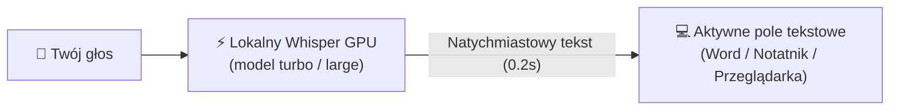
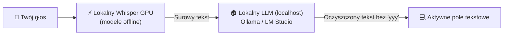
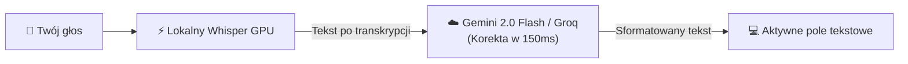

# 🎙️ Whiscribe — Natywne Wpisywanie Głosowe AI dla Windows (v2.1.9)

[](https://github.com/sooony/Whiscribe)
[](https://github.com/SYSTRAN/faster-whisper)
[](https://python.org)
[](https://developer.nvidia.com/cuda-zone)
[]()

**Whiscribe** to zaawansowana, ultraszybka aplikacja desktopowa do dyktowania i wpisywania głosowego w systemie Windows. Wykorzystuje lokalny model **Faster-Whisper large-v3-turbo** akcelerowany sprzętowo przez **NVIDIA CUDA** (oraz zoptymalizowany dla CPU), zapewniając jakość rozpoznawania mowy na poziomie komercyjnych rozwiązań chmurowych przy **zerowym opóźnieniu** i **100% prywatności** (działa całkowicie offline).

Aplikacja integruje się bezpośrednio z dowolnym polem tekstowym w systemie Windows — przeglądarkami (Chrome, Edge, Firefox), pakietem biurowym (Word, Excel), Notatnikiem, komunikatorami (Slack, Discord, Messenger, Teams) oraz środowiskami programistycznymi (VS Code, Cursor, Visual Studio).

---

## ✨ Kluczowe Możliwości

### 1. 🪟 Nowoczesny Pływający Widżet (Windows 11 Fluent Design)
- **Zawsze na wierzchu (Always on Top):** Widżet unosi się nad wszystkimi oknami systemu dzięki semantyce narzędziowej (`WS_EX_TOOLWINDOW`) oraz pętli *Topmost Keep-Alive*. Jest odporny na skrót `Win + D` (Pokaż pulpit) i nie chowa się pod inne aplikacje (np. przeglądarkę czy edytor).
- **Zero kradzieży fokusu (`WS_EX_NOACTIVATE`, `MA_NOACTIVATE`):** Kliknięcie w dowolny element widżetu nie zabiera kursora z edytora tekstu, w którym pracujesz.
- **Płynne przeciąganie i praca wielomonitorowa:** Przeciągaj widżet za belkę lub moduł dolny pomiędzy monitorami.

### 2. ⚡ Dwa Tryby Wpisywania (Streaming ON / OFF)
Na belce widżetu znajduje się dedykowany przełącznik:
- **Streaming ON (Pisanie na żywo):** Tekst pojawia się w polu tekstowym w czasie rzeczywistym, słowo po słowie, w trakcie gdy mówisz. Zaawansowany algorytm *Anchor-based Sequence Alignment* eliminuje powtórzenia i gubienie wyrazów.
- **Streaming OFF (Zatwierdzanie blokowe):** Wypowiadasz pełne zdanie lub akapit. Po zwolnieniu klawisza / kliknięciu przycisku lub po automatycznym wykryciu pauzy ciszy, zoptymalizowany tekst z pełną interpunkcją i wielkimi literami pojawia się błyskawicznie w miejscu kursora.

### 3. 🛡️ 5-Warstwowy Filtr Antyhalucynacyjny
Whiscribe posiada filtr eliminujący zniekształcenia typowe dla modeli Whisper (wtrącenia ze zwiastunów, podziękowania, slogany z YouTube), jednocześnie **chroniąc i bezbłędnie transkrybując naturalne polskie powitania i pożegnania** (np. *„cześć”*, *„dzień dobry”*, *„do widzenia”*, *„słuchajcie”*, *„na razie”*, *„dzięki za informację”*).

### 4. 🎯 Inteligentny Detektor Pola Tekstowego (Focus Detector)
Zaawansowany inspektor oparty na Windows UI Automation:
- Weryfikuje, czy kursor faktycznie znajduje się w aktywnym elemencie edycyjnym (`<input>`, `<textarea>`, Notatnik, edytor kodu, dokument tekstowy).
- Zapobiega przypadkowemu wklejaniu tekstu na pulpit, do menu kontekstowego lub na paski narzędziowe.
- Wyświetla elegancki dymek informacyjny z przyciskiem *„Rozumiem”* w razie braku aktywnego pola tekstowego.

### 5. 🖱️ Integracja z Myszką Logitech MX Master & Skróty Klawiszowe
- Rejestracja skrótów na poziomie jądra Windows (`RegisterHotKey`) połączona z uniwersalnym listenerem przechwytującym zdarzenia wstrzykiwane przez oprogramowanie myszy (np. **Logi Options+**).
- Wystarczy przypisać skrót `Ctrl + Alt + D` do przycisku pod kciukiem (Gesture Button) w Logi Options+, aby sterować dyktowaniem jednym kliknięciem myszy.

### 6. 🧠 Architektura AI: Czysty Offline Whisper vs Korekta LLM

Whiscribe został zaprojektowany z myślą o **bezwzględnej prywatności i zerowej zależności od chmury**.

#### 🔒 Tryb 1: Domyślny — 100% Offline (Tylko Lokalny Whisper)
Domyślnie w pliku `config.json` opcja `use_llm` ma wartość `false`, a `llm_api_key` jest puste.
Aplikacja **nie wysyła ani jednego bajta do internetu**. Całe rozpoznawanie mowy odbywa się na Twojej karcie graficznej NVIDIA (lub CPU):



#### 🏠 Tryb 2: 100% Offline z Własnym Lokalnym LLM (Ollama / LM Studio)
Jeśli masz na komputerze uruchomiony lokalny model językowy (np. **Ollama** z modelem `llama3.2` / `bielik` na porcie 11434 lub **LM Studio** na porcie 1234), możesz włączyć inteligentną korektę tekstu **w 100% lokalnie i bez dostępu do sieci**:



**Konfiguracja w `config.json` dla Ollama:**
```json
"use_llm": true,
"llm_provider": "ollama",
"llm_endpoint": "http://localhost:11434/v1",
"llm_model": "llama3.2",
"llm_api_key": ""
```

#### ☁️ Tryb 3: Opcjonalny Chmurowy (Google Gemini 2.0 Flash / Groq / OpenAI)
Dla użytkowników, którzy nie mają zasobów na uruchomienie drugiego modelu na komputerze, istnieje opcja podpięcia ultraszybkiego chmurowego API:



#### 📝 Dlaczego prompt systemowy (`llm_system_prompt`) ma taką formę?
```text
"Jesteś polskim korektorem tekstu dyktowanego. Popraw zająknięcia (np. yyy, eee), błędy interpunkcyjne i formatowanie. Nie zmieniaj sensu wypowiedzi. Zwróć WYŁĄCZNIE poprawiony tekst, bez żadnych dodatkowych komentarzy ani cudzysłowów."
```
1. **„Popraw zająknięcia (np. yyy, eee)”** – usuwa naturalne zawahania głosu i powtórzenia słów.
2. **„Nie zmieniaj sensu wypowiedzi”** – zabrania modelowi dopowiadania własnych myśli i przeinaczania Twoich słów.
3. **„Zwróć WYŁĄCZNIE poprawiony tekst, bez żadnych dodatkowych komentarzy ani cudzysłowów”** – kluczowa instrukcja techniczna. Gwarantuje, że model nie doda wstępu typu *„Oto poprawiony tekst:”* ani cudzysłowów, dzięki czemu do dokumentu trafia idealnie czysta treść.
4. **Pełna personalizacja:** Możesz zmienić ten prompt w `config.json`, np. nakazując modelowi formatowanie wypowiedzi w stylu oficjalnego maila biznesowego lub tworzenie punktowanej listy zadań!

---

## 🔮 Roadmap: Transkrypcja Spotkań i Separacja Mówców (Diarization)

Aplikacja jest aktywnie rozwijana w kierunku **inteligentnego asystenta spotkań zespołowych** (Teams, Google Meet, Zoom):

1. **Równoległy nasłuch dwukanałowy (Mikrofon + Audio Systemowe WASAPI Loopback):**
   - Rejestrowanie głosu użytkownika bezpośrednio z mikrofonu fizycznego.
   - Rejestrowanie głosu pozostałych rozmówców z wyjścia audio (głośniki / słuchawki).
2. **Rozpoznawanie uczestników na podstawie tonu głosu (Audio Tone & Pitch Diarization):**
   - Wdrożenie algorytmów analizy częstotliwości podstawowej ($F_0$), harmonicznych oraz centroidu widmowego.
   - Automatyczne przypisywanie wypowiedzi do poszczególnych osób w zespole na podstawie unikalnej barwy głosu rozmówcy.
3. **Automatyczne notatki i protokoły spotkań:**
   - Eksport uporządkowanej transkrypcji z podziałem na role do Notatnika Windows i plików Markdown.
   - Generowanie podsumowań, wniosków i listy zadań (*Action Items*) po zakończeniu spotkania.

---

## 🚀 Szybki Start

### Wariant A: Wersja Przenośna (Portable .EXE — Bez instalacji Pythona)
1. Pobierz najnowsze wydanie `Whiscribe-Portable.zip` z zakładki [Releases](https://github.com/sooony/Whiscribe/releases).
2. Rozpakuj archiwum w dowolnym miejscu (np. na Pulpicie lub dysku `C:\`).
3. Uruchom `Whiscribe.exe`.
4. Gotowe! Przy pierwszym uruchomieniu kreator sprzętowy zweryfikuje Twoją kartę graficzną i przygotuje model AI.

### Wariant B: Uruchomienie ze Źródeł (Dla Deweloperów)

Wymagania: Python 3.10 lub nowszy, opcjonalnie karta NVIDIA z obsługą CUDA.

```bash
# 1. Sklonuj repozytorium
git clone https://github.com/sooony/Whiscribe.git
cd Whiscribe

# 2. Utwórz i aktywuj środowisko wirtualne
python -m venv venv
venv\Scripts\activate

# 3. Zainstaluj wymagane biblioteki
pip install -r requirements.txt

# 4. Uruchom aplikację
python app.py
```

---

## ⚙️ Konfiguracja (`config.json`)

Plik `config.json` tworzony jest automatycznie w katalogu aplikacji:

```json
{
  "hotkey": "<ctrl>+<alt>+d",
  "hotkey_meeting": "<ctrl>+<alt>+m",
  "mode": "toggle",
  "model_size": "turbo",
  "device": "cuda",
  "compute_type": "float16",
  "language": "pl",
  "always_on_top": true,
  "stream_realtime": false,
  "require_text_field": true,
  "sound_feedback": true,
  "auto_stop_silence_seconds": 4.5,
  "theme": "dark",
  "use_llm": false,
  "llm_provider": "gemini",
  "llm_api_key": "",
  "llm_model": "gemini-2.0-flash",
  "llm_system_prompt": "Jesteś polskim korektorem tekstu dyktowanego. Popraw zająknięcia (np. yyy, eee), błędy interpunkcyjne i formatowanie. Nie zmieniaj sensu wypowiedzi. Zwróć WYŁĄCZNIE poprawiony tekst, bez żadnych dodatkowych komentarzy ani cudzysłowów."
}
```

### Wybrane parametry:
- `always_on_top`: Utrzymuje widżet stale na wierzchu ekranu ponad wszystkimi oknami.
- `stream_realtime`: Włącza lub wyłącza pisanie na żywo w trakcie mówienia (można przełączać przyciskiem na widżecie).
- `require_text_field`: Blokuje start nagrywania, jeśli kursor nie stoi w polu tekstowym.
- `auto_stop_silence_seconds`: Czas ciszy (w sekundach), po którym nagranie zostanie automatycznie zatwierdzone (np. `4.5` lub `0` dla trybu ręcznego).
- `use_llm`: Włącza opcjonalną korektę tekstu przez model językowy.

---

## 🔒 Bezpieczeństwo i Prywatność

- **Brak telemetrii:** Aplikacja nie zbiera żadnych danych telemetrycznych ani statystyk użytkowania.
- **Poufność audio:** Dźwięk z mikrofonu jest przetwarzany w pamięci RAM i na lokalnym GPU przez bibliotekę Faster-Whisper. Żadne nagrania ani próbki audio nie są wysyłane do chmury.
- **Izolacja poświadczeń:** Klucze API (o ile korzystasz z opcjonalnego post-processingu LLM) są przechowywane wyłącznie w lokalnym pliku `config.json` zabezpieczonym regułami `.gitignore`.

---

## 📄 Licencja

Projekt udostępniony na licencji [MIT](LICENSE). Możesz go swobodnie używać, modyfikować i wdrażać do własnych zastosowań.
